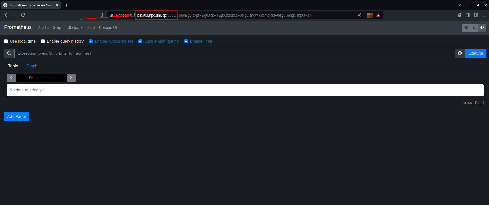

# **Instalação e Configuração Básica do Prometheus**

- [**Instalação e Configuração Básica do Prometheus**](#instalação-e-configuração-básica-do-prometheus)
- [Descrição](#descrição)
- [Instalação do Prometheus](#instalação-do-prometheus)
  - [Configuração do Epel](#configuração-do-epel)
  - [Instalação](#instalação)
- [Configurações Básicas](#configurações-básicas)
  - [Ativação do Serviço](#ativação-do-serviço)
  - [Acesso ao Painel do Prometheus](#acesso-ao-painel-do-prometheus)
  - [Arquivos de Configuração](#arquivos-de-configuração)

## Descrição

> [!IMPORTANT]
> Nessa documentação o [Prometheus][prometheus] estará sendo instalado em um servidor [Rocky 9.3][rocky], se estiver usando outro tipo de distribuição Linux, os comandos podem variar, se preciso consulte a documentação da sua distribuição ou pesquise online.

É possível instalar o [Prometheus][prometheus] através de dois métodos no [Rocky 9.3][rocky]. Ele pode ser realizado pelo próprio binário no [site oficial do Prometheus](https://prometheus.io/download/), ou através do uso do [Epel][epel], que será nossa escolha nessa documentação.

Para prosseguir com a instalação do [Prometheus][prometheus] continua para a próxima etapa.

## Instalação do Prometheus

### Configuração do Epel

O [Epel][epel] é um repositório com diversos pacotes do [Fedora](https://fedoraproject.org/) não essenciais para o funcionamento de servidores. Em nosso caso iremos instalar o pacote `golang-github-prometheus` que está dentro do repositório do [Epel][epel].

Para liberar a instalação desse pacote, será necessário alterar as configurações do [Epel][epel]. Portanto modifique o arquivo `/etc/yum.repos.d/epel.repo`, incluindo dentro do `includepkgs` o pacote `golang-github-prometheus`.

> [!WARNING]
> Se não souber realizar isso, consulte a documentação do [Epel Limitado][epel_limitado_doc], nessa documentação é mostrado passo-a-passo como executar isso

### Instalação

Agora com o [Epel][epel] configurado, verifique se é possível a instalação do pacote do [Prometheus][prometheus], para isso execute o seguinte comando:

```bash
dnf se prometheus #Pesquisa pacotes com o nome 'prometheus' 
```

A saída esperada deve sar algo parecido com isso:

```bash
Last metadata expiration check: 1:23:40 ago on Thu 20 Jun 2024 08:49:38 PM -03.
====================== Name & Summary Matched: prometheus ======================
golang-github-prometheus.x86_64 : Prometheus monitoring system and time series database # <- pacote que iremos instalar
====================== Summary Matched: prometheus ======================
systemtap-exporter.x86_64 : Systemtap-prometheus interoperation mechanism
```

> [!TIP]
> Se o pacote não aparecer, verifique se seguiu corretamente os passos da [documentação do Epel Limitado][epel_limitado_doc].

Após isso, execute o seguinte comando para instalar o pacote `golang-github-prometheus`:

```bash
sudo dnf install golang-github-prometheus
```

## Configurações Básicas

### Ativação do Serviço

Após a instalação do [Prometheus][prometheus], é possível checar o status do serviço com o seguinte comando:

```bash
systemctl status prometheus
```

A saída esperada deve ser algo parecida com a seguinte:

```bash
○ prometheus.service - Monitoring system and time series database
     Loaded: loaded (/usr/lib/systemd/system/prometheus.service; disabled; preset: disabled)
     Active: inactive (dead)
       Docs: https://prometheus.io/docs/introduction/overview/
             man:prometheus(1)
```

É possível notar o status de `disabled` e `inactive (dead)`, para ativá-lo, execute o seguinte comando:

```bash
sudo systemctl enable prometheus
sudo systemctl start prometheus
```

### Acesso ao Painel do Prometheus

Após os passos anteriores, o serviço deve estar rodando e pronto para ser usado, sendo assim já deve ser possível acessar o painel do Prometheus na porta `9090`.

Se estiver instalando na própria máquina, apenas abra a url `http://localhost:9090/` no seu navegador.

Se estiver instalando em um servidor, é preciso habilitar a porta `9090` ou o serviço do [Prometheus][prometheus] no firewall, para isso, utilize a documentação do [firewall-cmd](../utils/firewall-cmd.md). Após habilitar a porta ou o serviço, entre no seu navegador e coloque, na URL, o endereço de IP ou o endereço no DNF mais a porta 9090.

No nosso exemplo, estamos usando a máquina `laser03.hpc.univap` que está configurada no DNS, acessando a URL `http://laser03.hpc.univap:9090`, deve ser possível acessar o painel do [Prometheus][prometheus], assim como na imagem a seguir:



### Arquivos de Configuração

Para se conectar com outros softwares, o [Prometheus][prometheus] já vem com um arquivo de configuração padrão. Em nosso caso, que estamos usando o [Rocky 9.3][rocky], ele estará no caminho `/etc/prometheus/prometheus.yml`.

> [!TIP]
> Caso esteja em outra distribuição, isso pode mudar, se for caso, tente o comando `rpm -ql golang-github-prometheus | grep .yml`, se não for possível, pesquise sobre o pacote de sua distribuição online.

Dentro desse arquivo `yml` é possível configurar as conexões com o [Node Exporter][node_exporter_doc] e com o [Alertmanager][alertmanager_doc], para entender isso mais a fundo consulte a documentação de [conexão dos serviços de monitoramento](./monitoring_services_connections.md), lá é passado como configurar as conexões entre todos esses serviços.

<!--- Links de documentação e referências  --->
[rocky]:https://docs.rockylinux.org/release_notes/9_3/
[prometheus]:https://prometheus.io/docs/
[epel]:https://docs.fedoraproject.org/en-US/epel/

[epel_limitado_doc]:../utils/epel-limitado-prometheus.md
[node_exporter_doc]:node_exporter.md
[alertmanager_doc]:alertmanager.md
