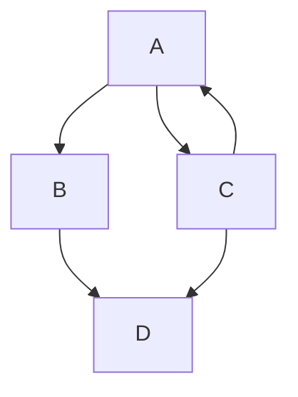

# Tittle h1

## Tittle h2

### Tittle h3

<!-- COMENTÁRIO -->

New line:
***


**bond**
_italic_

Unordered lists

- something 0
  - something 1
  - something 1
- something 0
- something 0

Ordered lists

1. something 0
2. something 0
   1. something 1
   2. something 1
3. something 0
4. something 0

```python
def f():
    return "Hellow, world!"

print(f())
```

```C
#include <stdio.h>

int main() {
    printf("Hello, world!\n");
    return 0;
}
```

normal text `marked text`

[Github][Git Hub]

[Git Hub]: https://github.com/GustavoBehnck/Documentations

| head 0 | head 1 |
| ------ | ------ |
| x      | y      |
| A      | B      |

If you are in visual code (in linux) you can format the markdown file with `Ctrl+Shift+i`



> [!NOTE]
> Useful information that users should know, even when skimming content.

> [!TIP]
> Helpful advice for doing things better or more easily.

> [!IMPORTANT]
> Key information users need to know to achieve their goal.

> [!WARNING]
> Urgent info that needs immediate user attention to avoid problems.

> [!CAUTION]
> Advises about risks or negative outcomes of certain actions.

<details>

<summary>Tips for collapsed sections</summary>

### You can add a header

You can add text within a collapsed section.

You can add an image or a code block, too.

```ruby
   puts "Hello World"
```

</details>
