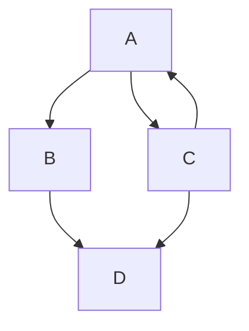

# Titulo h1

## Titulo h2

### Titulo h3

<!-- COMENTÁRIO -->

Adição de uma linha:
***


**Negrito**
_Italico_
~~Cortado~~

Listas não ordenadas

- 1
  - dadada
  - teadada
- 2
- 3

Listas ordenadas

1. adas
2. asda
3. asd
4. asd

```python
def f():
    return b+a
```

a variavel `asdasd`

[Github][docs-grafana]

[docs-grafana]: https://google.com

| adsasd | disahdi |
| ------ | ------- |
| 1      | 2       |
| asdasd | sdfsfd  |

É possível formatar a tabela com o `Ctrl+Shift+i`



> [!NOTE]
> Useful information that users should know, even when skimming content.

> [!TIP]
> Helpful advice for doing things better or more easily.

> [!IMPORTANT]
> Key information users need to know to achieve their goal.

> [!WARNING]
> Urgent info that needs immediate user attention to avoid problems.

> [!CAUTION]
> Advises about risks or negative outcomes of certain actions.

<details>

<summary>Tips for collapsed sections</summary>

### You can add a header

You can add text within a collapsed section.

You can add an image or a code block, too.

```ruby
   puts "Hello World"
```

</details>
