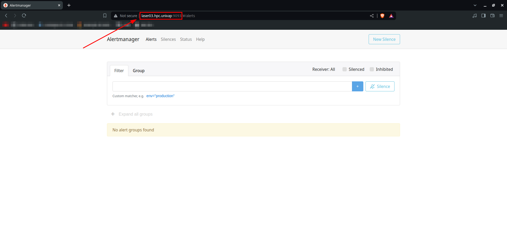

# **Instalação e Configurações Básicas do Alertmanager**

- [**Instalação e Configurações Básicas do Alertmanager**](#instalação-e-configurações-básicas-do-alertmanager)
  - [Descrição](#descrição)
  - [Instalação do Alertmanager](#instalação-do-alertmanager)
    - [Configuração do Epel](#configuração-do-epel)
    - [Instalação](#instalação)
  - [Configurações Básicas](#configurações-básicas)
    - [Ativação do Serviço](#ativação-do-serviço)
    - [Acesso ao Painel do Node Exporter](#acesso-ao-painel-do-node-exporter)

## Descrição

> [!IMPORTANT]
> Nessa documentação o [Alertmanager][alertmanager] estará sendo instalado em um servidor [Rocky 9.3][rocky], se estiver usando outro tipo de distribuição Linux, os comandos podem variar, se preciso consulte a documentação da sua distribuição ou pesquise online.

É possível instalar o [Alertmanager][alertmanager] através de dois métodos no [Rocky 9.3][rocky]. Ele pode ser realizado pelo próprio binário no [site oficial do Prometheus](https://prometheus.io/download/), ou através do uso do [Epel][epel], que será nossa escolha nessa documentação.

Para prosseguir com a instalação do [Alertmanager][alertmanager] continua para a próxima etapa.

## Instalação do Alertmanager

### Configuração do Epel

O [Epel][epel] é um repositório com diversos pacotes do [Fedora](https://fedoraproject.org/) não essenciais para o funcionamento de servidores. Em nosso caso iremos instalar o pacote `golang-github-prometheus-alertmanager` que está dentro do repositório do [Epel][epel].

Para liberar a instalação desse pacote, será necessário alterar as configurações do [Epel][epel]. Portanto modifique o arquivo `/etc/yum.repos.d/epel.repo`, incluindo dentro do `includepkgs` o pacote `golang-github-prometheus-alertmanager`.

> [!WARNING]
> Se não souber realizar isso, consulte a documentação do [Epel Limitado][epel_limitado_doc], nessa documentação é mostrado passo-a-passo como executar isso

### Instalação

Agora com o [Epel][epel] configurado, verifique se é possível a instalação do pacote do [Alertmanager][alertmanager], para isso execute o seguinte comando:

```bash
dnf se alertmanager #Pesquisa pacotes com o nome 'alertmanager' 
```

A saída esperada deve sar algo parecido com isso:

```bash
Last metadata expiration check: 23:32:07 ago on Thu 20 Jun 2024 08:49:38 PM -03.
====================== Name & Summary Matched: alertmanager ======================
golang-github-prometheus-alertmanager.x86_64 : Prometheus Alertmanager # <- pacote que iremos instalar
```

> [!TIP]
> Se o pacote não aparecer, verifique se seguiu corretamente os passos da [documentação do Epel Limitado][epel_limitado_doc].

Após isso, execute o seguinte comando para instalar o pacote `golang-github-prometheus-alertmanager`:

```bash
sudo dnf install golang-github-prometheus-alertmanager
```

## Configurações Básicas

### Ativação do Serviço

Após a instalação do [Alertmanager][alertmanager], é possível checar o status do serviço com o seguinte comando:

```bash
systemctl status prometheus-alertmanager
```

A saída esperada deve ser algo parecida com a seguinte:

```bash
○ prometheus-alertmanager.service - Alertmanager for Prometheus
     Loaded: loaded (/usr/lib/systemd/system/prometheus-alertmanager.service; disabled; preset: disabled)
     Active: inactive (dead)
       Docs: https://prometheus.io/docs/alerting/alertmanager/
```

É possível notar o status de `disabled` e `inactive (dead)`, para ativá-lo, execute o seguinte comando:

```bash
sudo systemctl enable prometheus-alertmanager
sudo systemctl start prometheus-alertmanager
```

### Acesso ao Painel do Node Exporter

Após os passos anteriores, o serviço deve estar rodando e pronto para ser usado, sendo assim já deve ser possível acessar o painel do Prometheus na porta `9093`.

Se estiver instalando na própria máquina, apenas abra a url `http://localhost:9093/` no seu navegador.

Se estiver instalando em um servidor, é preciso habilitar a porta `9093` ou o serviço do [Alertmanager][alertmanager] no firewall, para isso, utilize a documentação do [firewall-cmd](../utils/firewall-cmd.md). Após habilitar a porta ou o serviço, entre no seu navegador e coloque, na URL, o endereço de IP ou o endereço no DNF mais a porta 9093.

No nosso exemplo, estamos usando a máquina `laser03.hpc.univap` que está configurada no DNS, acessando a URL `http://laser03.hpc.univap:9093`, deve ser possível acessar o painel do [Alertmanager][alertmanager], assim como na imagem a seguir:



Agora o [Alertmanager][alertmanager] já deve estar pronto para o uso, para configurá-lo com o [Prometheus][prometheus], utilize a documentação de [conexão dos serviços de monitoramento](./monitoring_services_connections.md), lá é passado como configurar as conexões entre todos esses serviços de monitoramento de hardware.

<!--- Links de documentação e referências  --->
[rocky]:https://docs.rockylinux.org/release_notes/9_3/
[prometheus]:https://prometheus.io/docs/
[epel]:https://docs.fedoraproject.org/en-US/epel/
[alertmanager]:https://prometheus.io/docs/alerting/latest/alertmanager/

[epel_limitado_doc]:../utils/epel-limitado-prometheus.md
