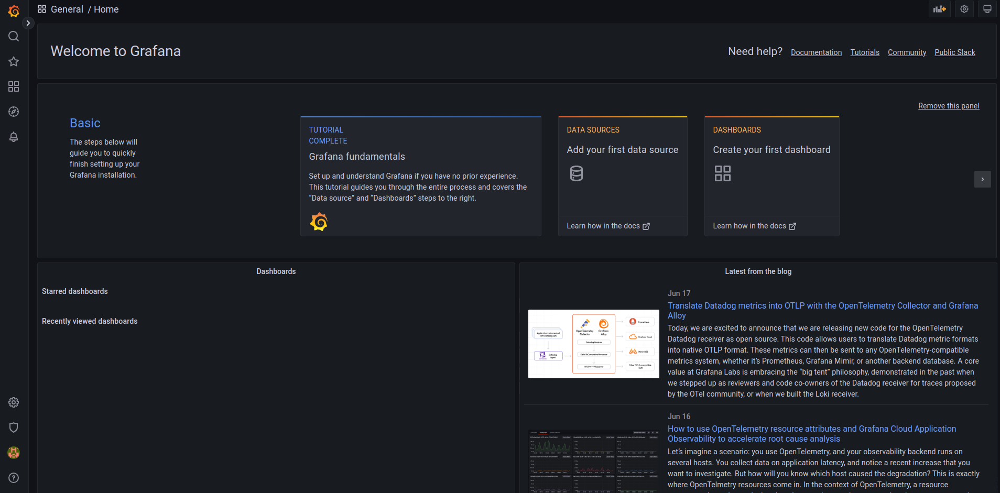

# **Instalação e Configuração Básicas do Grafana**

- [**Instalação e Configuração Básicas do Grafana**](#instalação-e-configuração-básicas-do-grafana)
  - [Instalação](#instalação)
    - [Descrição](#descrição)
    - [Verificar Pacote](#verificar-pacote)
    - [Instalação do Pacote](#instalação-do-pacote)
  - [Configuração](#configuração)
    - [Ativação do Serviço do Grafana](#ativação-do-serviço-do-grafana)
    - [Acessar o Painel do Grafana](#acessar-o-painel-do-grafana)
    - [Mudar Senha do Painel do Grafana](#mudar-senha-do-painel-do-grafana)

## Instalação

> [!IMPORTANT]
> Nessa documentação o [Grafana][grafana] estará sendo instalado em um servidor [Rocky 9.3][rocky], se estiver usando outro tipo de distribuição Linux, os comandos podem variar, se preciso consulte a documentação da sua distribuição ou pesquise online.

### Descrição

Há duas principais formas de instalar o [Grafana][grafana], uma através do RPM e outra pelo pacote já fornecido pelo sistema.

Se for utilizar pelo RPM, utilize o seguinte [link](https://grafana.com/docs/grafana/latest/setup-grafana/installation/redhat-rhel-fedora/).

Para continuar a instalação pelo pacote do próprio [Rocky 9.3][rocky], siga as seguintes etapas:

### Verificar Pacote

> [!WARNING]
> Para as próximas etapas, é preciso estar logado com um usuário com permissão de root para executar comandos de instalação e entre outros

Primeiramente vamos verificar se o pacote do [Grafana][grafana] está disponível para a instalação, para isso, execute o seguinte comando para buscar os pacotes:

```bash
dnf search grafana
```

Após a execução do comando acima, deverá ser ser possível ver uma saída parecida com a seguinte:

```bash
================= Name Exactly Matched: grafana =================
grafana.x86_64 : Metrics dashboard and graph editor
================= Name & Summary Matched: grafana =================
grafana-pcp.x86_64 : Performance Co-Pilot Grafana Plugin
grafana-selinux.x86_64 : SELinux policy module supporting grafana # <- NÃO BAIXE ESSE
```

> [!CAUTION]
> Se o pacote `grafana-selinux` apareceu como no exemplo assim, não o baixe, para isso não acontecer, certifique-se se travar seu sistema operacional no [Rocky 9.3][rocky], é possível fazer isso com a [documentação do rpm e dnf](../utils/rpm-e-dnf.md#impedir-upgrades-de-os-minor-version).
>
> Se não quiser travá-lo, poderá ter problemas quando chegar na parte de [conexões entre os serviços](monitoring_services_connections.md) por conta das restrições do [SELinux][selinux].

### Instalação do Pacote

Após verificar que o pacote está disponível para a instalação, podemos usar o seguinte comando para instalar o grafana:

```bash
sudo dnf install grafana
```

## Configuração

### Ativação do Serviço do Grafana

Após a instalação, é possível verificar o status do grafana através do seguinte comando:

```bash
systemctl status grafana-server.service
```

O serviço por padrão vem `disabled` e `dead`, como a seguir:

```bash
○ grafana-server.service - Grafana instance
     Loaded: loaded (/usr/lib/systemd/system/grafana-server.service; disabled; preset: disabled)
     Active: inactive (dead)
       Docs: http://docs.grafana.org
```

Para habilitar e ativar ele, execute o seguinte comando:

```bash
sudo systemctl enable grafana-server
sudo systemctl start grafana-server
```

Apos isso, o [Grafana][grafana] já deverá estar `enabled` e `active`, isso pode ser verificado usando novamente o comando `systemctl status grafana-server.service`.

### Acessar o Painel do Grafana

Após a instalação e ativação do serviço do grafana, já deve ser possível acessar o painel do grafana na porta `3000`.

Se estiver instalando na própria máquina, apenas abra a url `http://localhost:3000/` no seu navegador.

Se estiver instalando em um servidor, é preciso habilitar a porta `3000` ou o serviço do grafana no firewall, para isso, utilize a documentação do [firewall-cmd](../utils/firewall-cmd.md). Após habilitar a porta ou o serviço, entre no seu navegador e coloque, na URL, o endereço de IP ou o endereço no DNF mais a porta 3000.

No nosso exemplo, estamos usando a máquina `laser03.hpc.univap` que está configurada no DNS, acessando a URL `http://laser03.hpc.univap:3000`, deve ser possível acessar o painel do [Grafana][grafana], assim como na imagem a seguir:


### Mudar Senha do Painel do Grafana

Ao entrar no painel, a senha padrão de root é sempre `admin` para a senha e usuário, portanto digite-a e clique em `Login in`.

Em seguida aparecerá no painel a opção de trocar a senha de root, apenas digite a senha desejada e clique em `Submit`.

Após deverá o painel do [Grafana][grafana] já pronto para o uso, como na imagem a seguir:



Certo, se tudo fluiu corretamente, painel do [Grafana][grafana] já deve estar pronto para o uso.

> [!TIP]
> Para configurar o grafana com o [Prometheus](https://prometheus.io/docs/introduction/overview/) e os outros serviços de monitoramente de hardware, siga a documentação de [conexão dos serviços de monitoramento](./monitoring_services_connections.md) para continuar.

<!--- Links de documentação e referências  --->
[rocky]:https://docs.rockylinux.org/release_notes/9_3/
[grafana]:https://grafana.com/docs/grafana/

[selinux]:https://www.redhat.com/en/topics/linux/what-is-selinux
