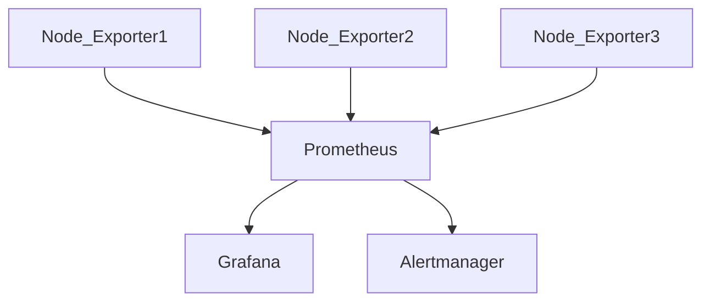
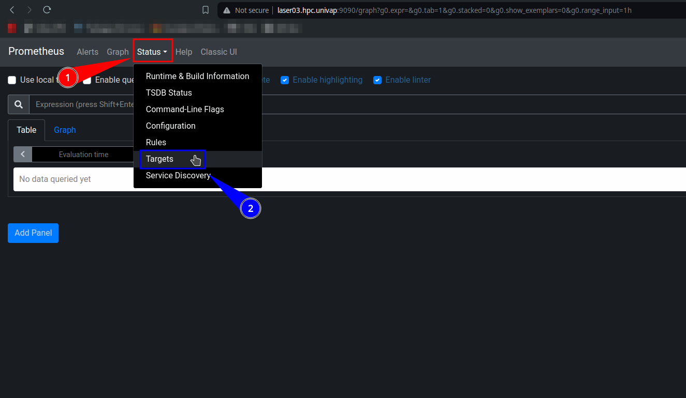
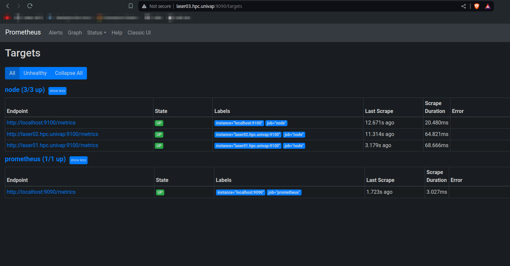
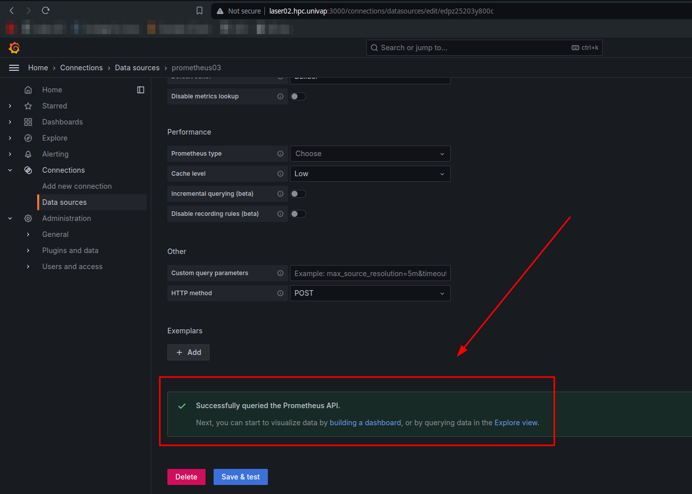

# **Configurando as Conexões entre os Seriços de Monitoramente de Hardware**

> [!CAUTION]
> Para essa documentação, certifique-se de já ter realizado os passos de instalação e configurações básicas dos seguintes serviços:
>
>- [Grafana][grafana_doc]
>- [Prometheus][prometheus_doc]
>- [Node Exporter][node_exporter_doc]
>- [Alertmanager][alertmanager_doc]

> [!IMPORTANT]
> Está documentação está sendo feita baseada no [Rocky 9.3][rocky], se estiver utilizando outra distribuição Linux, é possível que caminhos de diretórios ou comandos específicos sejam diferentes, se for esse o caso, consulte como isso é feito na sua distribuição.

## Descrição

> [!NOTE]
> Para realizar algumas ações dessa documentação, é preciso ter permissão de `admin` no sistema ou estar logado como `root`.

Nessa documentação, iremos realizar a configuração de conexão entre os serviços de monitoramento de hardware. Sendo eles o [Grafana][grafana_doc], [Prometheus][prometheus_doc], [Node Exporter][node_exporter_doc] e [Alertmanager][alertmanager_doc].

A comunicação entre eles será feita como o diagrama a seguir:



Os [Node Exporters][node_exporter_doc] irão passar as métricas de hardware da máquina instalada para um Prometheus, que por sua vez fornecerá esses dados para o [Grafana][grafana_doc] realizar os gráficos de uso dos hardware e para o [Alertmanager][alertmanager_doc] monitorar e alertar quando necessário.

Para deixar mais claro durante a documentação, essa é uma tabela dos serviços e portas de cada um:

| **Serviço**                        | **Porta** | **Serviço do [firewall-cmd][firewall_doc]** |
| ---------------------------------- | --------- | ------------------------------------------- |
| [Grafana][grafana_doc]             | 3000/tcp  | grafana.xml                                 |
| [Prometheus][prometheus_doc]       | 9090/tcp  | prometheus.xml                              |
| [Node Exporter][node_exporter_doc] | 9100/tcp  | prometheus-node-exporter.xml                |
| [Alertmanager][alertmanager_doc]   | 9093/tcp  | ~~no service~~                              |

## Conectando um Node Exporte com o Prometheus

Para o [Prometheus][prometheus_doc] tirar as métricas, ele será precisará "escutar" a porta `9100` das máquinas que estão com os [Nodes Exporters][node_exporter_doc].

Para isso, é preciso mudar o arquivo de configuração do [Prometheus][prometheus_doc], esse arquivo está presente no `/etc/prometheus/prometheus.yml` da máquina, usando o seguinte comando é possível editar ele:

```bash
sudo vim /etc/prometheus/prometheus.yml
```

Após abrir o arquivo, desça até encontrar a sessão `job_name: node`, dentro dele há o campo `targets`, esse é o local que ele estará "escutando" as métricas dos nodes. Como exemplo, estamos usando duas máquinas configuradas no DNS, a `laser01.hpc.univap` e a `laser02.hpc.univap`, para "escutar" ambas, editamos da seguinte forma:

```bash
  - job_name: node
    # If prometheus-node-exporter is installed, grab stats about the local
    # machine by default.
    static_configs:
      - targets: ['localhost:9100','laser02.hpc.univap:9100','laser01.hpc.univap:9100']
```

Após editar o arquivo, será necessário reiniciar o serviço do [Prometheus][prometheus_doc] com o seguinte comando:

```bash
sudo systemctl restart prometheus
```

Agora, ao entrar no painel do [Prometheus][prometheus_doc] e acessando o painel `Targets` com na imagem a seguir:



Deve ser possível ver as máquinas conectadas ao seu [Prometheus][prometheus_doc], como na seguinte imagem:



## Usando o Grafana com o Prometheus

### Conectando o Grafana com o Prometheus

Para conectar o [Grafana][grafana_doc] ao [Prometheus][prometheus_doc], precisamos adicioná-lo como um `Data source` dentro do painel do [Grafana][grafana_doc].

Já no painel do [Grafana][grafana_doc], siga as seguintes etapas para a conexão:

  1. entre na página de `Data sources` (`Connections -> Data source` ou `Configuration -> Data sources`)
  2. clique no botão `+ Add new data source` ou `Add data source`
  3. Digite o nome que deseja utilizar para sua `Data source`
  4. Na parte de `Connection` ou `HTTP -> URL` digite seu endereço do [Prometheus][prometheus_doc], em nosso caso será `http://laser03.hpc.univap:9090`
  5. Vá ao final da página e clique na opção `Save & test`, após isso, deverá aparecer a seguinte mensagem na tela:
  

> [!TIP]
> Se houve alguma mensagem de erro, isso pode ser por vários motivos, principalmente por bloqueios na comunicação entre os serviços (certifique-se de que as configurações de `firewall` estejam corretas na documentação [firewall-cmd][firewall_doc]).
>
> Se em algum error houver algo como `dial tcp [::1]:9090: connect: permission denied`, é provável que seja a configuração do SELinux que esteja bloqueando isso.

### Criando um Dashboard com o Prometheus

Agora com a conexão com o [Prometheus][prometheus_doc] já realizada, podemos criar um `Dashboard` de monitoramente de uso do hardware no [Grafana][grafana_doc].

#### Importando um Dashboard

Para fins de simplificar essa documentação, iremos importar um `Dashboard` já feito. Dentro do site <https://grafana.com/grafana/dashboards/> há uma imensa quantidade de Dashboards feitos pela comunidade. Se quiser, você pode criar um seu próprio dentro do painel do [Grafana][grafana_doc], em nosso caso, pegaremos o `Dashboard` com id `1860`.

Para realizar a importação do Dashboard, siga as seguintes etapas:

  1. No menu lateral, clique em `Dashboards`
  2. Selecione a opção `+ Create Dashboard` ou em `New -> New dashboard`
  3. Utilize a opção `Import a dashboar`
  4. Coloque o ID do Dashboar ou seu `Json`
  5. Clique em `Load`
  6. Coloque o nome que desejar e selecione o `Datasource` que configurou no [passo anterior](#conectando-o-grafana-com-o-prometheus)
  7. E clique em `Import`, se tudo seguiu corretamente, deverá ser possível ver seu `Dashboard` com as configurações do seu [Prometheus][prometheus_doc]

<!--- Links de documentação e referências  --->
[grafana_doc]:grafana.md
[alertmanager_doc]:alertmanager.md
[node_exporter_doc]:node_exporter.md
[prometheus_doc]:prometheus.md

[firewall_doc]:../utils/firewall-cmd.md
[rocky]:https://docs.rockylinux.org/release_notes/9_3/
